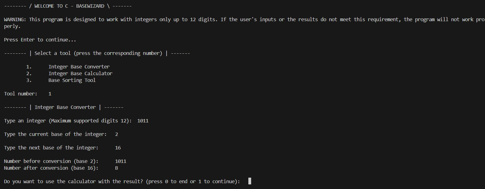

<h1 align="center">C-BaseWizard</h1>
<h3 align="center">A simple command-line toolkit written in C for performing basic math-related tasks with integers in different bases.</h3>

  

 

    

 

## Inspiration

This program demonstrates and puts into practice my basic-concept knowledge in the C programming language. Also, the toolkit assisted me during the <strong>Digital Technology Principles</strong> course of my MSc studies in University of West Attica.

## Features

This program takes as input by the user integers in 4 different bases (2,8,10,16) from the standard input (keyboard) and performs basic mathematical tasks with them, by using the following tools:

  -  <strong>Base Converter</strong> (Converts an integer from any supported base to another)
        
  -  <strong>Base Calculator</strong> (Performs the 4 basic math operations <code>+,-,*,/</code> between 2 integers in any supported base. The 2 integers may be in different base, thanks to the previous tool)
    
  -  <strong>Base Sorting Tool</strong> (Accepts as input variable amount of integers in any supported base, according to the user's needs and stores them in an array in an ascending value order)

These tools are connected to each other through the program's interface, so the user can flawlessly use one tool with the results of the previously used tool.

## Installation

To try out this project yourself (instructions for bash CLI):

  1)  Clone this repo typing <code>git clone https://github.com/christosgkoutzis/C-BaseWizard.git</code> 

  2)  Install gcc compiler (version used in development 11.4.0 for Ubuntu) by typing <code>sudo apt install gcc</code>

  3)  Run the program by typing <code>make run</code> command (makefile script included in the repo)

## Roadmap

-  Create more complicated math tools that involve reading and writing results to files with various formats
 
## Contributing

Please feel free to contribute to this project by forking this repo or letting me know about your opinion and/or suggestions on the project. For more information, contact me on my email or LinkedIn.
